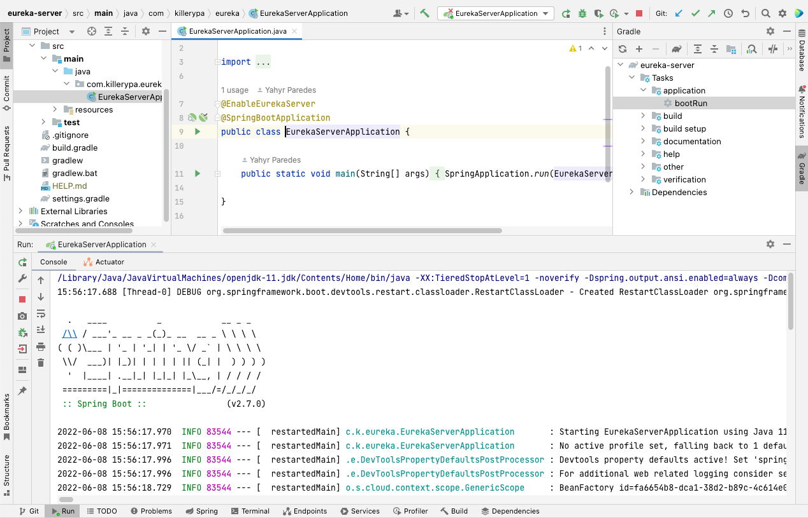
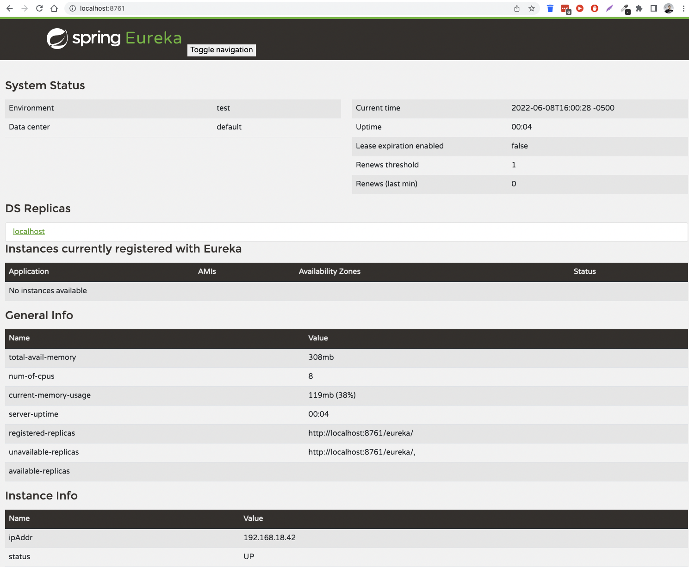
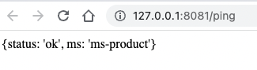
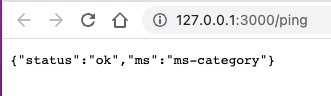
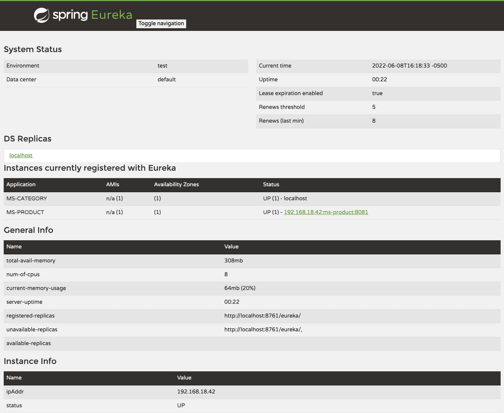
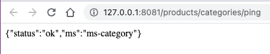
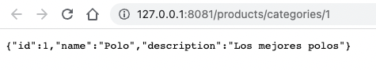
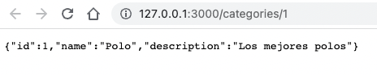

# Arquitectura de Microservicios 

**Sesion de Mentoria 1**

### Requerimientos
- Java 11+
- node 14+
- visual studio code 
- InteliJ IDEA

### Despliegue :
Como se pudo apreciar en clases tenemos que levantar 3 aplicaciones 
1. ms-product (java - spring boot - eureka client )
2. ms-category (nodejs - expressjs - simple eureka js)
3. eureka server ( java - eureka servidor)

#### Eureka-server
1. Abrimos el proyecto en intellij idea
2. Instalamos las dependecias de gradle

3. Ejecutamos el proyecto (tener cuidado con el puerto **8761**)
4. Vamos a nuestro navegador favorito y abrimos http://127.0.0.1:8761

5. Como podemos ver no tenemos ninguna aplicacion registrada

 

#### ms-product
1. Abrimos el proyecto en intellij idea
2. Instalamos las dependecias de gradle
3. Ejecutamos el proyecto (tener cuidado con el puerto **8081**)
4. Vamos a nuestro navegador favorito y abrimos http://127.0.0.1:8081/ping

#### ms-product
1. Abrimos el proyecto en visual studio code
2. Instalamos las dependecias de node
3. Ejecutamos el proyecto (tener cuidado con el puerto **3000**)
4. Vamos a nuestro navegador favorito y abrimos http://127.0.0.1:3000/ping
   

### Ejecucion completa
Luego de completar ejecutar los proyectos podemos observar lo siguiente

1. Los servicios ejecutados se han registrado en nuextro EUREKA SERVER MS-PRODUCT - MS-CATEGORY

2. Si vamos a esta url http://127.0.0.1:8081/products/categories/ping vamos a ver como podemos traer la respuerta del microservicio categoria  atraves del microservicios productos

3. Vamos a traer el detalle de una categoria desde el microservicio de productos  http://127.0.0.1:8081/products/categories/1

4. Vamos a traer el detalle de una categoria desde el microservicio de categorias http://127.0.0.1:3000/categories/1

### Refleccion:
**La idea del ejercicio es monstrarnos como funciona el services registry usando EUREKA SERVER y tambien 
la comunicacion de microservicios sin perder el poder de escalamiento haceindo una cominicacion dinamica entre microservicios.**
 

### Descripcion del caso practico:

Se diseñaron 2 microservicios, mscategory ( Escrito en NodeJS ) y msproduct ( Escrito en Java Spring Boot ), estos servicios se registran en un servidor Eureka lo que permite su descubrimiento mutuo y comunicacion, segun el diagrama de arquitectura basica de microservicios expuesta en la sesion teorica.

## Asignación

Escribir un microservicio adicional en el lenguaje de su preferencia que tambien se registre en el servidor de registro eureka para que sea descubrible por los otros microservicios.

Bibliotecas recomendadas:

- https://www.npmjs.com/package/eureka-js-client
- https://github.com/harmoney-jianbo/ruby-eureka
- https://www.nuget.org/packages/Steeltoe.Discovery.ClientCore/
